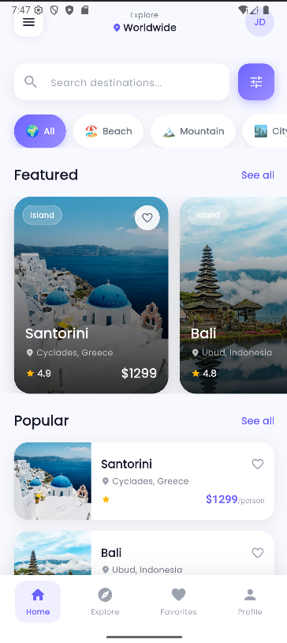
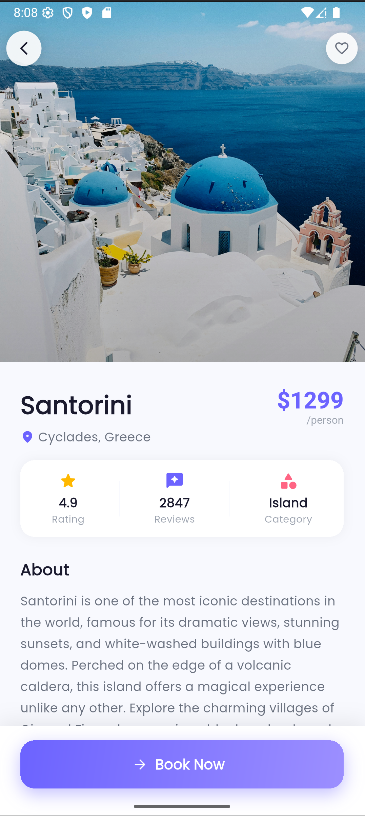
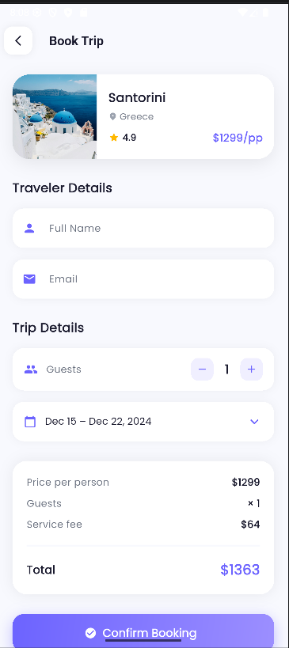
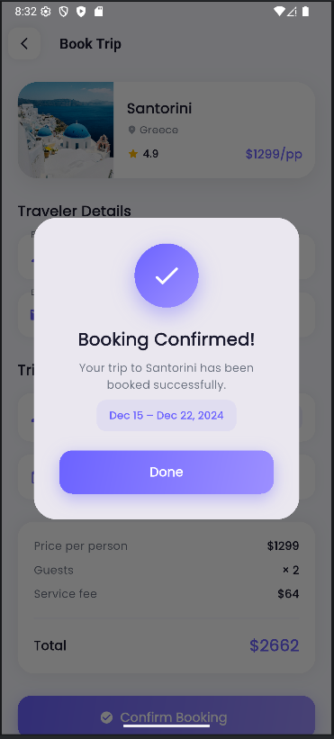
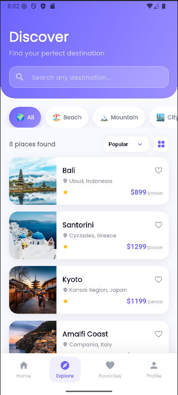
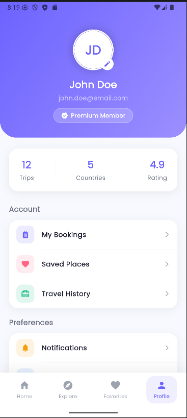
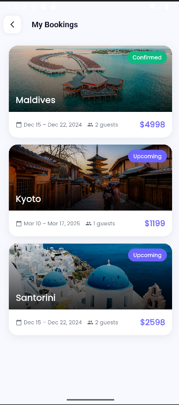

<div align="center">


<br/>
<br/>

# Travel App — Flutter UI Lab

### A premium multi-screen travel app UI built entirely with hard-coded Flutter data.
### No API. No database. Pure UI craftsmanship.

<br/>

> **Course:** Mobile Application Development &nbsp;|&nbsp; **Lab:** Hard-Coded Multi-Screen Travel App UI
> **Duration:** 1–2 Weeks &nbsp;|&nbsp; **Focus:** UI Design · Widget Composition · Navigation

</div>

---

## 👥 Team Members

<div align="center">

|  |  |
|:---:|:---:|
| **MUGISHA Joseph** | **SHEMA Paradise** |
| [@mugishaj092](https://github.com/mugishaj092) | [@paradise72](https://github.com/paradise72) |

</div>

---

## Table of Contents

| # | Section |
|---|---------|
| 1 | [Project Overview](#-project-overview) |
| 2 | [App Highlights](#-app-highlights) |
| 3 | [Screenshots](#-screenshots) |
| 4 | [Getting Started](#-getting-started) |
| 5 | [Hard-Coded Data](#-hard-coded-data) |
| 6 | [Screen-by-Screen Report](#-screen-by-screen-report) |
| 7 | [Widget Inventory](#-widget-inventory) |
| 8 | [Custom Reusable Widgets](#-custom-reusable-widgets) |

---

## Project Overview

This is a fully hard-coded **multi-screen Travel App UI** built with Flutter. Every destination, category, booking, and image is defined directly inside Dart files — no API, no backend, no database.

The app lets users:

- **Browse** 8 world-class destinations
- **Explore** and filter by category
- **View** detailed destination info with gallery
- **Book** trips with a form and confirmation dialog
- **Save** favorites with live toggle
- **Manage** profile and view booking history

---

## App Highlights

<div align="center">

| 7 Screens | 26 Widgets | 7 Custom Components |
|:---:|:---:|:---:|
| **Hero Animations** | **Local Assets** | **Poppins Typography** |
| **Gradient Design** | **IndexedStack Tabs** | **Animated Interactions** |

</div>

---

## 📸 Screenshots

> All screenshots taken from a live Flutter emerator.

<br/>

### Home Screen
> `CustomScrollView` · `SliverAppBar` · Featured horizontal cards · Category filter chips · Popular destinations list



---

### Detail Screen
> Hero image transition · Stats row · Scrollable description · Interactive gallery · Book Now button



---

### Booking Screen
> Booking summary card · Traveler form · Guest counter · Date dropdown · Price breakdown



---

### Booking Success Dialog
> Gradient checkmark · Confirmation message · Auto-navigate back to Home



---

### Explore Screen
> Gradient "Discover" header · Category chips · Sort dropdown · List / Grid toggle



---

### Profile Screen
> Gradient header · Stats row · Grouped menu sections · Logout dialog



---

### My Bookings Screen
> Booking cards with status badges · Confirmed & Upcoming states · Empty state support



---

## 🚀 Getting Started

### Prerequisites

```
Flutter SDK  ^3.11.0
Dart SDK     ^3.11.0
```

### Installation

```bash
# 1. Clone the repository
git clone https://github.com/mugishaj092/travel-app.git

# 2. Navigate to project
cd travel-app/travel_app

# 3. Install dependencies
flutter pub get

# 4. Run the app
flutter run
```

### Dependencies

```yaml
dependencies:
  flutter:
    sdk: flutter
  cupertino_icons: ^1.0.8
  google_fonts: ^6.2.1        # Poppins typography
```

---

## Hard-Coded Data

> **File:** `lib/data/travel_data.dart` — the single source of truth for all app data.

### Destinations — 8 total

| # | Destination | Location | Category | Price | Rating |
|---|-------------|----------|----------|-------|--------|
| 1 |  Santorini | Cyclades, Greece | Island | $1,299 | ⭐ 4.9 |
| 2 |  Bali | Ubud, Indonesia | Island | $899 | ⭐ 4.8 |
| 3 |  Machu Picchu | Cusco, Peru | Mountain | $1,599 | ⭐ 4.9 |
| 4 |  Maldives | North Malé Atoll | Beach | $2,499 | ⭐ 5.0 |
| 5 |  Kyoto | Kansai, Japan | City | $1,199 | ⭐ 4.8 |
| 6 |  Patagonia | Torres del Paine, Chile | Mountain | $1,899 | ⭐ 4.7 |
| 7 |  Amalfi Coast | Campania, Italy | Beach | $1,499 | ⭐ 4.8 |
| 8 |  Safari Serengeti | Mara Region, Tanzania | Desert | $3,299 | ⭐ 4.9 |

### Categories — 7 total

`All` &nbsp; `Beach` &nbsp; `Mountain` &nbsp; `City` &nbsp; `Forest` &nbsp; `Desert` &nbsp; `Island`


## Screen-by-Screen Report

---

### 1 · Home Screen

**File:** `lib/screens/home_screen.dart`

The Home Screen uses a `CustomScrollView` with sliver children for a smooth, collapsible AppBar experience. It is divided into five visual zones:

| Zone | Widget | Description |
|------|--------|-------------|
| AppBar | `SliverAppBar` (floating) | Menu icon · Location indicator · `CircleAvatar` profile badge |
| Search | `TextField` + `Container` | White card with shadow · Gradient filter button |
| Categories | `ListView.builder` | Horizontal `CategoryChip` scroll · Filters Popular list via `setState` |
| Featured | `ListView.builder` | Horizontal `DestinationCard` scroll (height 280) · `Stack` + `Hero` + gradient overlay |
| Popular | `SliverList` | `DestinationListTile` rows · Filtered by selected category · Tap → `DetailScreen` via `FadeTransition` |

**Key widgets:** `Scaffold` · `CustomScrollView` · `SliverAppBar` · `SliverList` · `ListView.builder` · `Hero` · `Stack` · `Positioned` · `AnimatedContainer` · `CircleAvatar` · `TextField`

---

### 2 · Detail Screen

**File:** `lib/screens/detail_screen.dart`

A `Stack` at the root allows the sticky "Book Now" bar to float via `Positioned`. The `SliverAppBar` with `expandedHeight: 380` creates a large collapsible hero image that shrinks as the user scrolls.

| Section | Description |
|---------|-------------|
| Hero Image | `FlexibleSpaceBar` wraps `Hero` widget — shared-element transition from Home card |
| Gradient Overlay | `DecoratedBox` with semi-transparent `LinearGradient` for text readability |
| Back Button | Custom circular `GestureDetector` — calls `Navigator.pop()` |
| Stats Row | Rating · Reviews · Category — displayed in a white `Container` card |
| Description | Scrollable `Text` with `height: 1.7` line spacing |
| Gallery | Horizontal `ListView.builder` — tap thumbnail updates `_selectedGalleryIndex` via `setState` · `AnimatedContainer` border on selected |
| Tags | `Wrap` of `Chip` widgets |
| Book Now | `Positioned` bottom bar with `CustomButton` → `Navigator.push` to `BookingScreen` |

**Key widgets:** `Scaffold` · `Stack` · `Positioned` · `SliverAppBar` · `FlexibleSpaceBar` · `Hero` · `AnimatedContainer` · `ClipRRect` · `Chip` · `Wrap` · `RichText`

---

### 3 · Booking Screen

**File:** `lib/screens/booking_screen.dart`

Uses `SingleChildScrollView` wrapping a `Column` — simple and scrollable for all screen sizes.

| Section | Widget | Description |
|---------|--------|-------------|
| Summary Card | `Container` + `ClipRRect` + `Image.asset` | Destination image + title + rating + price |
| Name Field | `TextField` + `TextEditingController` | Validated on submit |
| Email Field | `TextField` | Email keyboard type |
| Guest Counter | `Row` + `_CounterButton` | Increment / decrement `_guests` via `setState` |
| Date Selector | `DropdownButton` | 4 hard-coded date range options |
| Price Summary | `Column` of `_PriceRow` | Per-person · Guests · Service fee · **Total** |
| Confirm Button | `CustomButton` | Loading state → adds `Booking` to global list → shows `Dialog` |
| Validation | `SnackBar` | Shown if name field is empty |

**Key widgets:** `Scaffold` · `AppBar` · `SingleChildScrollView` · `TextField` · `DropdownButton` · `GestureDetector` · `Dialog` · `SnackBar`

---

### 4 · Explore Screen

**File:** `lib/screens/explore_screen.dart`

More immersive than Home — features a full-width gradient header with a curved bottom edge (`BorderRadius.vertical(bottom: Radius.circular(32))`).

| Feature | Description |
|---------|-------------|
| Gradient Header | `LinearGradient` from `#6C63FF` → `#9C8FFF` · "Discover" title · frosted-glass `TextField` |
| Category Filter | Same `CategoryChip` component as Home |
| Sort Dropdown | `DropdownButton` — Popular / Price: Low / Price: High / Rating |
| View Toggle | `GestureDetector` icon — switches between `SliverList` and `SliverGrid` |
| Grid Mode | `SliverGrid` with `crossAxisCount: 2` showing `DestinationCard` |
| List Mode | `SliverList` showing `DestinationListTile` |

---

### 5 · Favorites Screen

**File:** `lib/screens/favorites_screen.dart`

Filters the global `destinations` list using `Set<String> favorites` passed from `MainShell`.

| State | UI |
|-------|----|
| Has favorites | `SliverList` of `DestinationListTile` with count badge |
| Empty | `SliverFillRemaining` — centered icon + bold title + helper text |

---

### 6 · Profile Screen

**File:** `lib/screens/profile_screen.dart`

Uses `SingleChildScrollView` + `Column`. The gradient header uses a `Stack` to position the edit badge over the avatar.

| Section | Description |
|---------|-------------|
| Gradient Header | `AppTheme.primaryGradient` · `BorderRadius.vertical(bottom: Radius.circular(36))` · Avatar · Name · Email · Premium badge |
| Stats Row | Trips · Countries · Rating — separated by thin dividers |
| Account Menu | My Bookings → `Navigator.push` to `MyBookingsScreen` · Saved Places · Travel History |
| Preferences | Notifications · Language · Dark Mode |
| Support | Help · Privacy Policy · Logout → `AlertDialog` |

---


## Widget Inventory

> Lab requirement: **18+ widgets** &nbsp;|&nbsp; This project uses: **26 widgets**

| # | Widget | Category | Used In |
|---|--------|----------|---------|
| 01 | `Scaffold` | Structure | All screens |
| 02 | `AppBar` | Structure | BookingScreen · MyBookingsScreen |
| 03 | `SliverAppBar` | Structure | HomeScreen · DetailScreen |
| 04 | `CustomScrollView` | Scrolling | HomeScreen · ExploreScreen · FavoritesScreen |
| 05 | `SingleChildScrollView` | Scrolling | BookingScreen · ProfileScreen |
| 06 | `SafeArea` | Layout | MainShell bottom nav |
| 07 | `IndexedStack` | Layout | MainShell — preserves tab state |
| 08 | `Stack` | Layout | DestinationCard · DetailScreen · ProfileScreen |
| 09 | `Positioned` | Layout | DestinationCard · BookingCard · DetailScreen |
| 10 | `ListView.builder` | List | HomeScreen featured · DetailScreen gallery |
| 11 | `SliverList` | List | HomeScreen popular · ExploreScreen · FavoritesScreen |
| 12 | `SliverGrid` | Grid | ExploreScreen grid toggle |
| 13 | `Hero` | Animation | Card → Detail shared-element transition |
| 14 | `AnimatedContainer` | Animation | CategoryChip · FavoriteButton · gallery thumbnails |
| 15 | `Image.asset` | Display | All destination images (local assets) |
| 16 | `ClipRRect` | Display | Rounded image corners on all cards |
| 17 | `DecoratedBox` | Display | Gradient overlays on images |
| 18 | `CircleAvatar` | Display | HomeScreen AppBar · ProfileScreen |
| 19 | `Chip` | Display | Destination tags in DetailScreen |
| 20 | `RichText` | Display | Mixed-style price text |
| 21 | `TextField` | Input | Search bars · Booking form fields |
| 22 | `GestureDetector` | Input | Cards · buttons · gallery thumbnails |
| 23 | `DropdownButton` | Input | Date selector · sort-by filter |
| 24 | `Dialog` | Feedback | Booking success confirmation |
| 25 | `SnackBar` | Feedback | Booking form validation error |
| 26 | `ListTile` | Display | Profile screen menu items |

---

## Custom Reusable Widgets

| Widget | File | Purpose |
|--------|------|---------|
| `DestinationCard` | `widgets/destination_card.dart` | Featured horizontal card — `Stack` + `Hero` + gradient overlay + `FavoriteButton` + `RatingWidget` |
| `DestinationListTile` | `widgets/destination_list_tile.dart` | Row card — `Hero` thumbnail + location + `RatingWidget` + `RichText` price |
| `BookingCard` | `widgets/booking_card.dart` | Trip card — banner image + gradient + status badge + date + guests + total |
| `CategoryChip` | `widgets/category_chip.dart` | Animated filter pill — `AnimatedContainer` transitions white ↔ `primaryGradient` |
| `FavoriteButton` | `widgets/favorite_button.dart` | Animated heart toggle — `AnimatedContainer` changes fill on active |
| `RatingWidget` | `widgets/rating_widget.dart` | Star + score + optional review count — adapts color for dark/light backgrounds |
| `CustomButton` | `widgets/custom_button.dart` | Gradient `ElevatedButton` with optional icon — also supports outlined variant |

---
